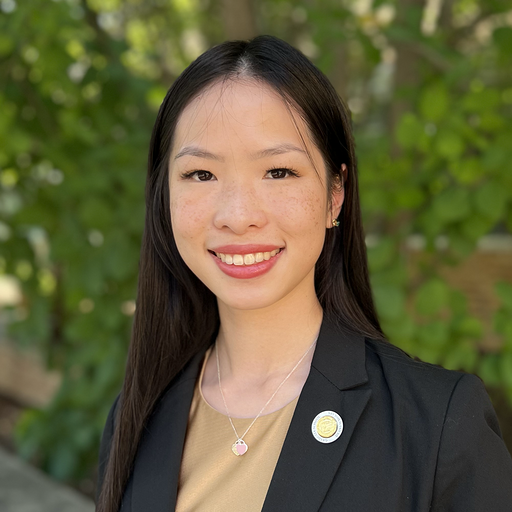
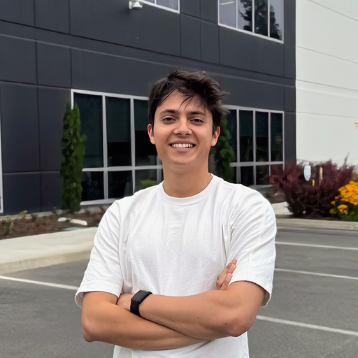
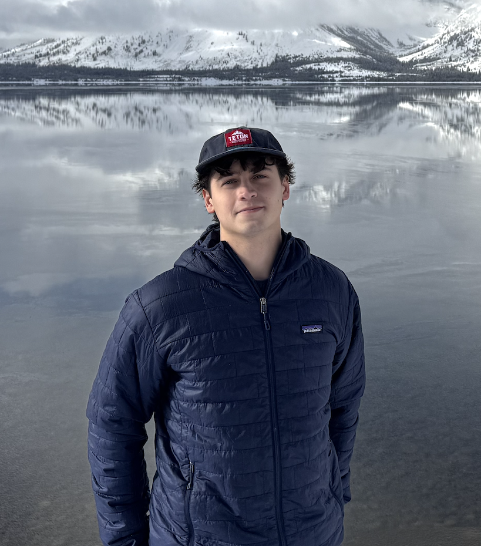
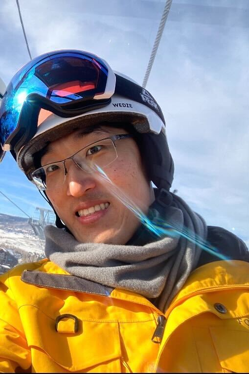

# Fast Robots @ Cornell
[Return to main page](../index.md)

## Teaching Team

### E. Farrell Helbling (she/her)

Farrell is an Assistant Professor at Cornell in the department of Electrical and Computer Engineering. She teaches Fast Robots, a graduate seminar in Micro/ Nano Robotics, and formerly taught ECE2300 from 2021-2023. She runs the [Helbling Robotics Lab](https://helbling-lab.github.io), which focuses on the design of cm-scale autonomous robots. Her research interests encompass cm-scale manufacturing and assembly techniques, as well as the integration of custom sensing and power systems with severe size, weight, and power constraints. In her spare time, she is either swimming, rowing, or cold plunging (anything to be on the water). 

### Julie Villamil (she/her)

Julie is a 4th year ECE PhD candidate in Dr. Farrell Helbling’s lab. Her research focuses on the development of tetherless crawling microrobots. She is particularly interested in the mechatronics, power electronics, and mechanical challenges in system-level design. Julie earned her Bachelor's in Mechanical Engineering at Florida International University, where she also worked on cm-scale robots. In her free time, Julie enjoys studying Christian theology, playing tennis, and caring for her cat named Sunflower.

### Jack Long (he/him)

Jack is an MAE undergrad in Prof. Helbling’s lab interested in microrobotics and aerospace. He enjoys running when Ithaca weather permits, and will commission into the U.S. Air Force in May of this year.

### Trevor Dales (he/him)

Trevor is a senior studying mechanical engineering, with an interest in aerospace. In my free time I enjoy cooking, running, and reading.

### Selena Yao (she/her)

### Lucca Correia (he/him)

Lucca is an MAE undergrad and Systems Engineering M.Eng student interested in robotics. On campus he is part of Prof. Helbling’s Lab and enjoys playing on the Cornell Club Soccer team and going backcountry skiing.

### Chenyu "Cheney" Zhang (he/him)

Chenyu Zhang is an MAE graduate student in Dr. Helbling’s lab, with a focus on robotics and minoring in applied physics. His research is focusing on microrobot design and the related physics at small scale. In his spare time Chenyu enjoys classical music and fossil hunting!

