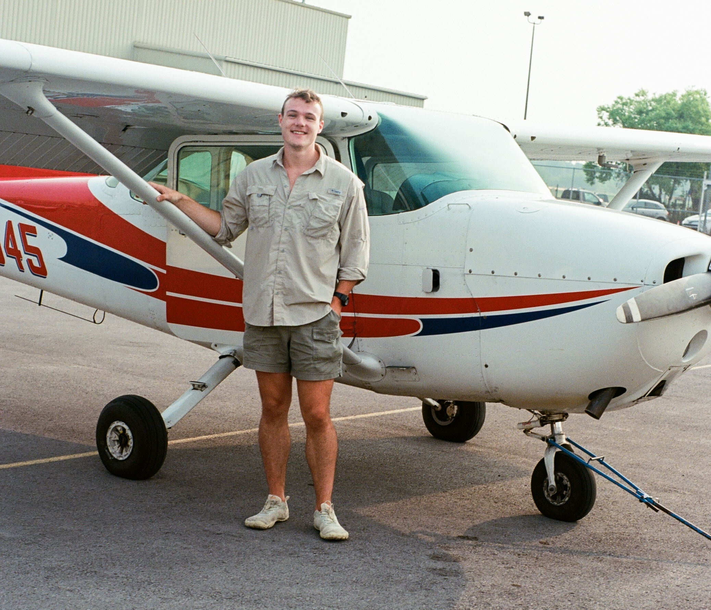

# Fast Robots @ Cornell
[Return to main page](../index.md)

## Teaching Team

### E. Farrell Helbling (she/her)

Farrell is an Assistant Professor at Cornell in the department of Electrical and Computer Engineering. She teaches Fast Robots, a graduate seminar in Micro/ Nano Robotics, and formerly taught ECE2300 from 2021-2023. She runs the [Helbling Robotics Lab](https://hrl.ece.cornell.edu/), which focuses on the design of cm-scale autonomous robots. Her research interests encompass cm-scale manufacturing and assembly techniques, as well as the integration of custom sensing and power systems with severe size, weight, and power constraints. In her spare time, she is either swimming, rowing, or cold plunging (anything to be on the water). 

### Julie Villamil (she/her)

### Jack Long (he/him)

### Trevor Dales (he/him)

### Selena Yao (she/her)

### Lucca Correia (he/him)

### Chenyu "Cheney" Zhang (he/him)

Cheney Zhang is an MAE graduate student from Prof. Helbling’s lab interested in microrobotic systems and biologically-inspired design. In his spare time, he enjoys classical music and tennis. He also loves fossil hunting and cross-country.

